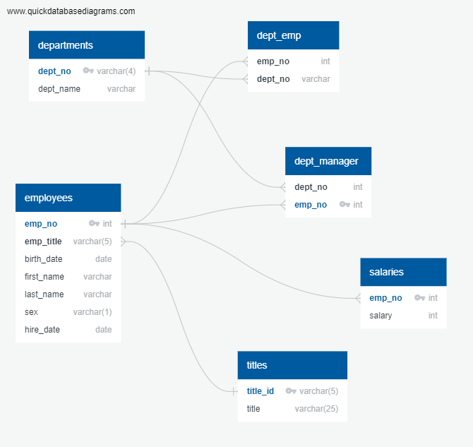

# sql-challenge

How does one go about setting up a SQL environment?  Start from the beginning with the data modeling, 
move on to the data engineering and then, and only then, can you start querring the database.  As I 
learned this is an interative process.  You think you have the model correct for the info but not
until you start importing the data do you get validation that you have modelled and set up the keys 
correctly.

Starting with the Data Modeling- Quick Data Base Diagrams was an easy to use program to create and 
visually link different data sources.

In pgAdmin 4, I created 6 different tables following the format developed within the data modeling step.
This turned out to be a good test of the model as some tables that I thought would have a certain column
as a primary key did not and I recieved an error when I imported the data.  With this information I then 
went back to the data source, reviewed it and adjusted the model and the table properties.

Once all the data was loaded into the database then we could slice and dice it.  Who was hired in 1986?
Who is the manager of sales?  Who is named Hercules and their last name begins with a "B".  I personally
don't know anyone but I do know someone who is named Hercules and their last name begins with a "D"!

This process makes a lot of sense to me and I look forward to applying it at work!